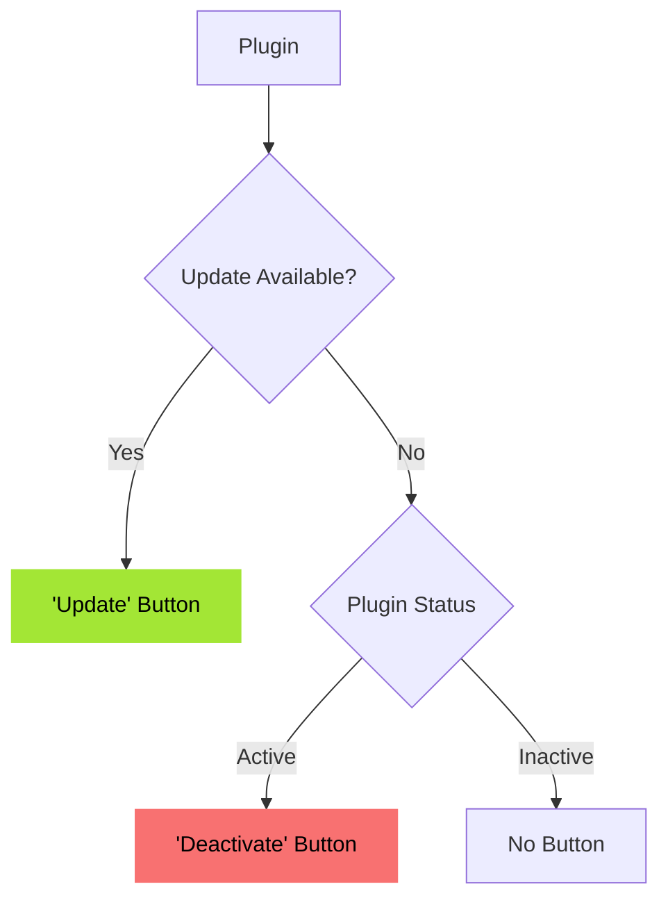
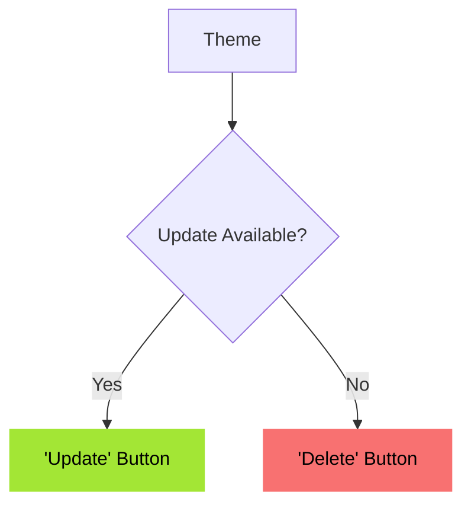
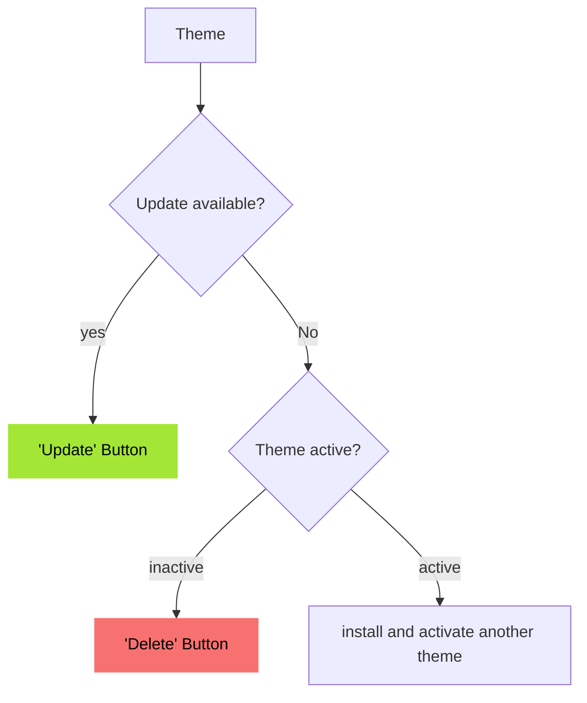

# WPScan

WPScan detects vulnerabilities in your installed plugins and themes.
Vulnerability data is sourced from [wpscan.com](https://wpscan.com/) via our middleware server.

There are two types of issues:
- High ("Critical") (CVSS ≥ 7)
- Medium ("Warning") (CVSS < 7)

Both types are handled similarly but are listed under different headings.

### Security Plugin (legacy workflow)
### Plugins
For each issue, there is exactly one recommended action. If an update is available, a "Show update information" option is displayed.

### Themes
For each issue, there is exactly one recommended action. "Show update information" is not displayed, even if an update is available.
The theme's active status is not considered—active themes can also be deleted.

## Essentials Plugin
### Plugins

### Themes

