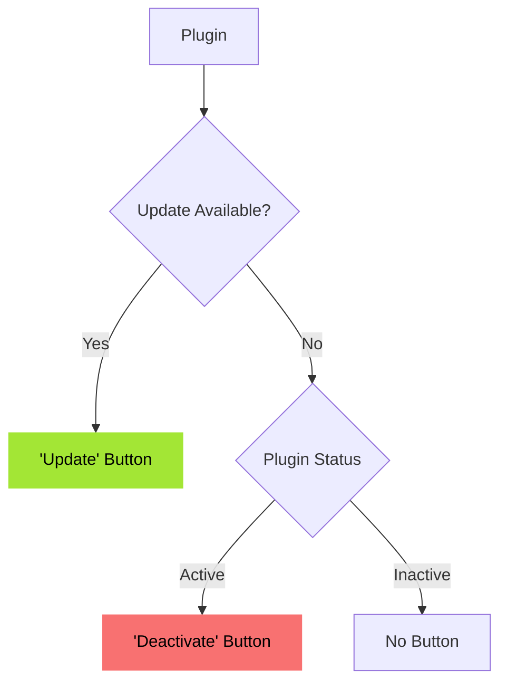

# WPScan

WPScan identifies any vulnerabilities present in your installed plugins or themes.
Vulnerability data is sourced from https://wpscan.com/ through our own middleware server.

There are two types of isses:
- High ("Critical") (CVSS >= 7 )
- Medium ("Warning") (CVSS < 7)

## Plugins
For every issue, there is exactly one recommendend action. "Show update information" is shown if update is available.


## Themes
For every issue, there is exactly one recommendend action. No "Show update information" is shown, even if update is available.
It is not considered, if a theme is active or not. Even an active theme is beeing deleted.
```mermaid
flowchart TD
  A[Theme] --> B{Update Available?}
  B -- Yes --> F['Update' Button]
  B -- No --> D['Delete' Button]


  classDef greenNode fill:#a3e635,stroke-width:0px,color:#000;
  class F greenNode;

  classDef redNode fill:#f87171,stroke-width:0px,color:#000;
  class D redNode;
