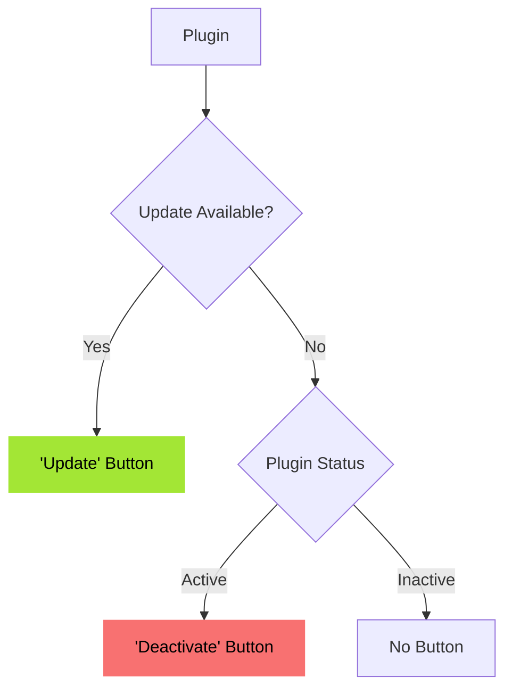
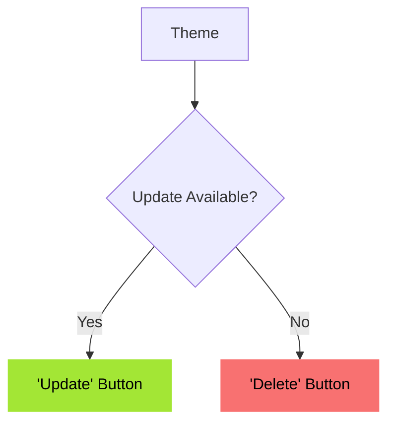
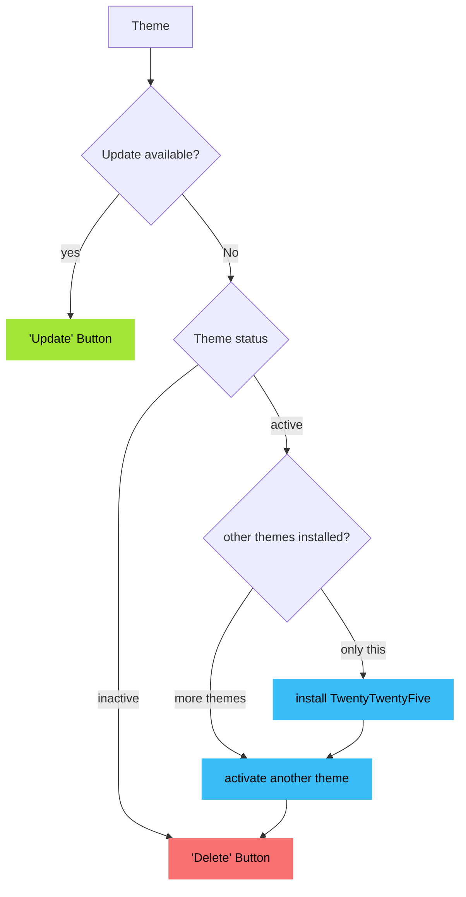

# WPScan

WPScan identifies any vulnerabilities present in your installed plugins or themes.
Vulnerability data is sourced from https://wpscan.com/ through our own middleware server.

There are two types of isses:
- High ("Critical") (CVSS >= 7 )
- Medium ("Warning") (CVSS < 7)

## Plugins
For every issue, there is exactly one recommendend action. "Show update information" is shown if update is available.

## Themes
For every issue, there is exactly one recommendend action. No "Show update information" is shown, even if update is available.
It is not considered, if a theme is active or not. Even an active theme is beeing deleted.

## Proposal
### Plugins

### Themes

Green and red buttons are shown to the user, blue nodes happen secretly in the background without any further ado by the user.
