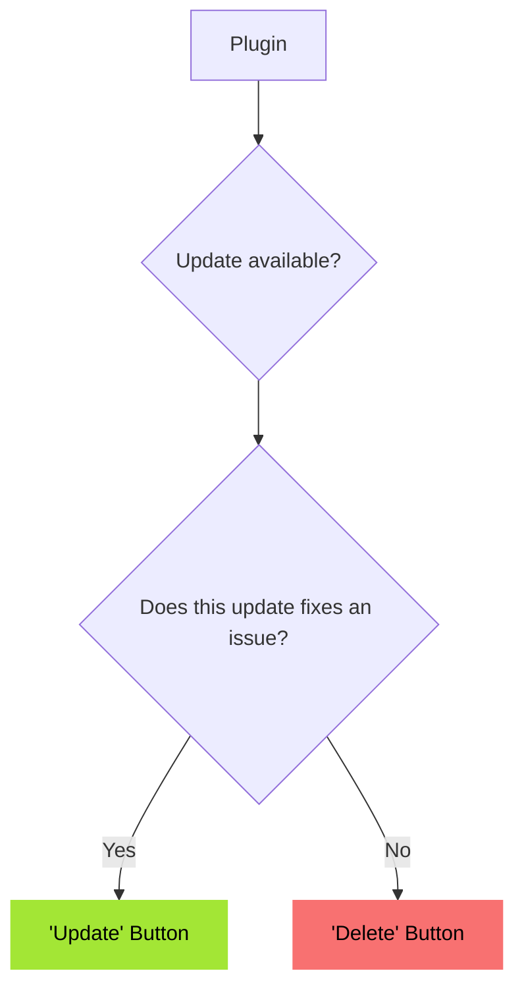

# WPScan

WPScan detects vulnerabilities in your installed plugins and themes.
Vulnerability data is sourced from [wpscan.com](https://wpscan.com/) via our middleware server.

There are two types of issues:

- High ("Critical") (CVSS ≥ 7)
- Medium ("Warning") (CVSS < 7)

Both types are handled similarly but are listed under different headings.

For warnings, the user sees a hint before installation, for Criticals, installation is not possible (by disabling the button ).

## The Code

The codebase generally follows the MVC (Model-View-Controller) pattern.

### Controllers

- **Middleware Controller**: Handles all communication with our middleware server.
- **REST Controller**: Provides REST API endpoints for our AJAX requests.
- **WPScan Controller**: Manages admin notices, gathers information for the dashboard tab, and prevents installation of plugins with critical vulnerabilities.

### Views

- **Summary View**: Renders the summary card at the top of the dashboard tab.
- **Issues View**: Displays detailed information for each vulnerability detected.

### JavaScript

- On the plugin installation page, JavaScript inserts warnings and hints before installation.
- On the theme installation page, JavaScript inserts warnings and hints before installation.
- The theme overview script displays scan results on the theme overview page.
- There is no JavaScript for the plugin overview; this functionality is handled entirely in PHP (see the _add_plugin_issue_notice_ method).

## Workflow in the dashboard

### Plugins

### Themes

See https://docs.google.com/document/d/1wJTMBKej7Qo4B5m2sYt_IriLsMBmdpC609iU5oKGPSQ/edit?tab=t.0 for information about the decision.
