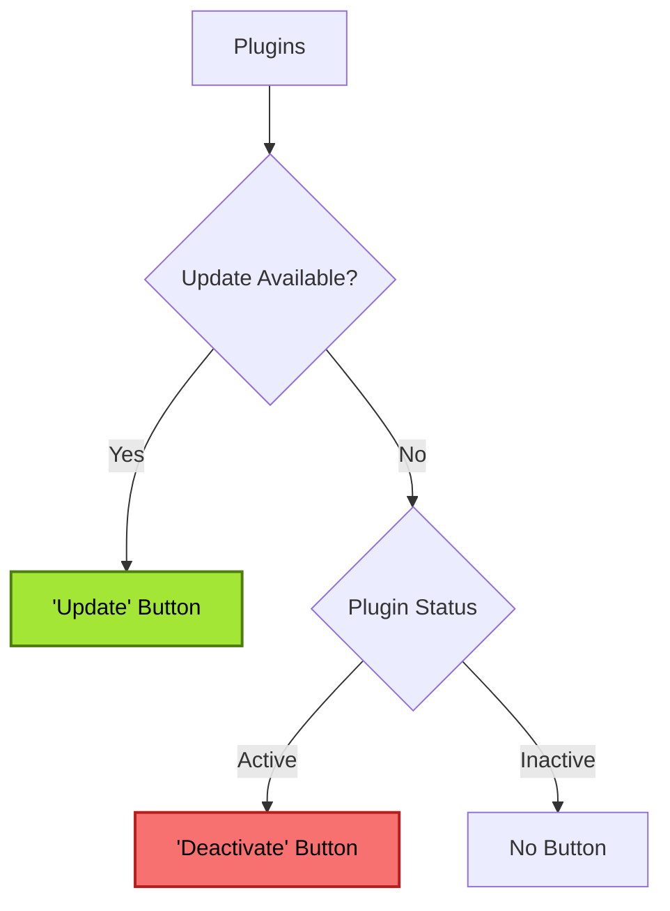

# WPScan

WPScan shows, if there are any vulnerabilities in the installed plugins or themes.
The database https://wpscan.com/ is used, via a middleware server of ours.

There are two types of isses:
- High ("Critical") (CVSS >= 7 )
- Medium ("Warning") (CVSS < 7)

## Plugins
For every issue, there is exactly one recommendend action (a button)

